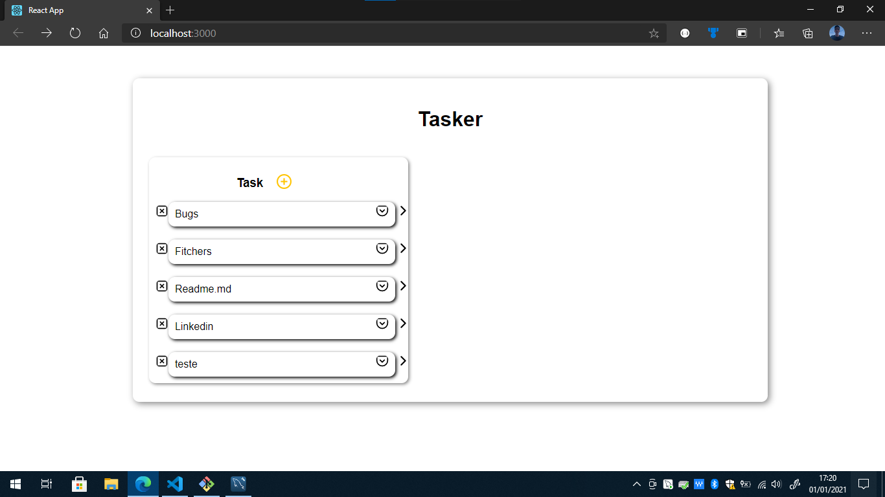
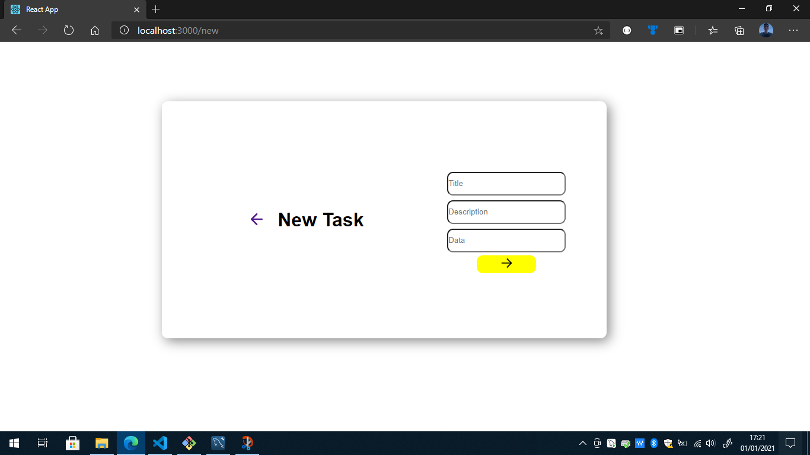

# Agenda

Aplicação de uma agenda com nodejs e react. Um teste de aplicação web servindo de aprendizagem e fixação de novos conhecimentos.

Utilizei os conhecimentos adquiridos na Semana Omnistack, em especial a Semana Omnistack 11.0





---

#### Tecnologias utilizadas:

```
  Node.js
  Mysql
  Knex
  React.js
```

---

#### BACKEND COM NODEJS
No backend utilizei o __knex__ para manter conexão com bd __mysql__ . 

Criado dois _controllers_:
  - Um para controlar ações do __Profile__
  - Outro para o controle da __Task__
  

#### FRONTEND COM REACT
No frontend utilizei o __axios__ para consumir a _api_ Rest.

Criei dois components react:
  - Um para renderizar a __Dashboard__:
    - Renderização de todos as tasks
    - Botão para adicionar uma nova task
    - Mais detalhes da task
    - Exclusão de uma  task
  - Outro para renderizar a adição de uma nova task

Utilizei alguns icones do _react-icons_.

---

### Execução

É necessário ter [Git](https://git-scm.com/), [nodejs](https://nodejs.org/en/) e [react](https://pt-br.reactjs.org/) instalado em sua máquina

Clone o repositório em sua máquina
```bash
# Faça um clone com 
$ git clone https://github.com/castelogui/agenda.git
```

#### Backend
Em `agenda/backend/`
```bash
# Instale as dependências nescessárias
$ npm install

# Rode as migrates
$ npm run migrate

# Rode as seeds 
$ npm run seed

# Coloque a _api_ em execução
$ npm start
```
#### Frontend
Em `agenda/frontend/`
```bash
# Instale as dependências nescessárias
$ npm install

# Inicie o web em execução 
$ npm start  

```

