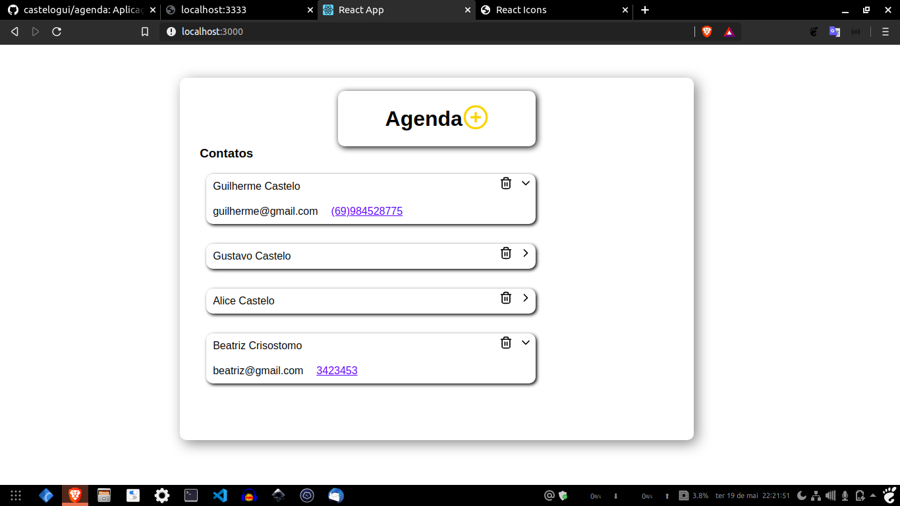
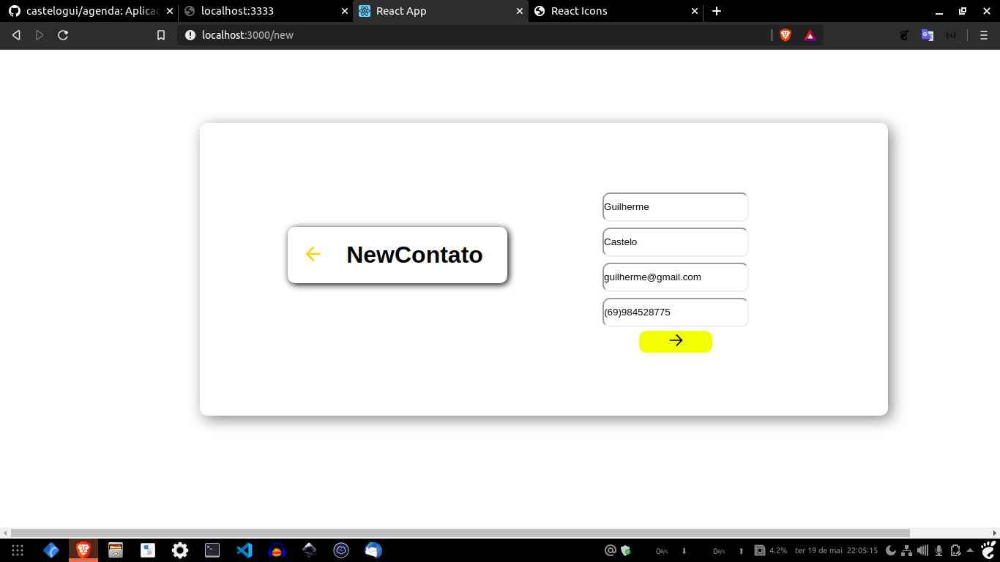

# Agenda

Aplicação de uma agenda com nodejs e react. Foi apenas um teste de aplicação web servindo de aprendizagem e fixação de novos conhecimentos.

Utilizei os conhecimentos adquiridos na Semana Omnistack, em especial a Semana Omnistack 11.0





---

#### Tecnologias utilizadas:

```
  Node.js
  React.js
```

---

#### BACKEND COM NODEJS
No backend utilizei o __knex__ como banco de dados pela facilidade que tive em criar as _migrations_ e fazer as _connections_. Utilizei também o __express__ para as rotas. 

Foi criado dois _controllers_:
  - Um para controlar ações do __Contato__:
    - Listagem unitária
    - Exclusão
  - Outro para o controle da __Agenda__ em si:
    - Listagem de todos os _contatos_
    - Criação de um contato na _Agenda_
    
#### FRONTEND COM REACT
No frontend utilizei o __axios__ para consumir a _api do backend_.

Foi criado dois _componentes_:
  - Um para renderizar a __Agenda__:
    - Renderização de todos os _contatos_
    - Ação para adicionar novo _Contato_
    - Exclusão de _Contato_
  - Outro para renderizar a adição de um __Novo Contato__

Em cada componente, utilizei alguns icones do _react-icons_.

---

### Usabilidade

Na usabilidade existem duas telas. A primeira é a tela da Agenda, a _home_. Ela lista todos os contatos e suas informações, cada contato contém tem um botão de excluir e um botão para exibir mais informações.

Logo em baixo do título da página, há um botão para adicionar um novo contato. Quando clicado, o usuário é redirecionado para a página de Novo Contato. 

Para adicionar um contato é necessário __4 dados__:
  - Nome
  - Sobrenome
  - Email
  - Número

Assim que é adicionado um novo contato, o usuário é redirecionado para a _home_(__Agenda__) que em seguida renderiza todos os contatos, inclusive o novo contato adicionado que é renderizado em ultima posição.

---

### Execução

É necessário ter [Git](https://git-scm.com/), [nodejs](https://nodejs.org/en/) e [react](https://pt-br.reactjs.org/) instalado em sua máquina

Clone o repositório em sua máquina
```bash
# Faça um clone com 
$ git clone https://github.com/castelogui/agenda.git
```

#### Backend
Em `agenda/backend/`
```bash
# Instale as dependências nescessárias
$ npm install

# Rode as migrates para criação da base de dados
$ npm run migrate

# Coloque a _api_ em execução
$ npm start
```
#### Frontend
Em `agenda/frontend/`
```bash
# Instale as dependências nescessárias
$ npm install

# Coloque a  web em execução 
$ npm start  

```

E pronto, adicione quantos contatos quiser :sweat_smile:

